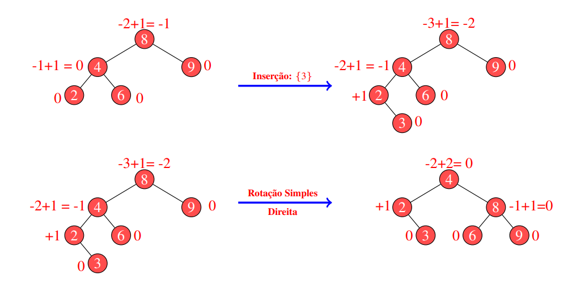
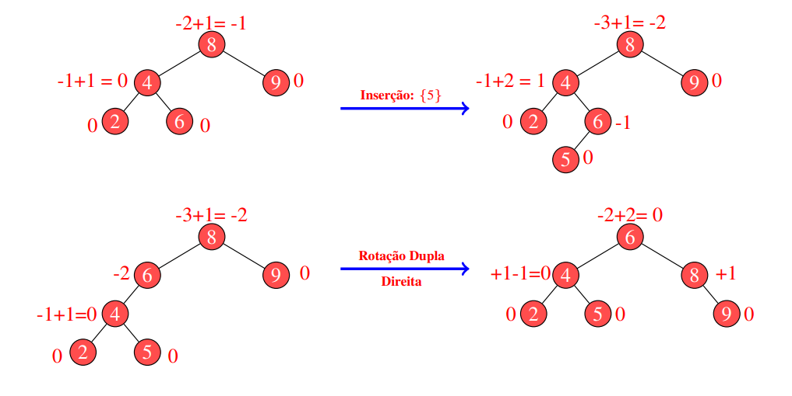
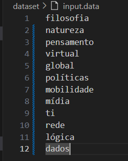
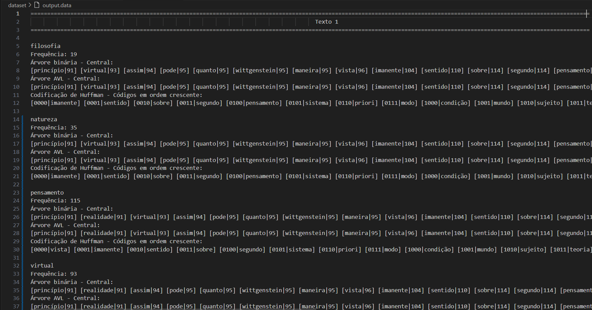
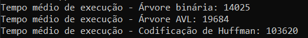

<h1 align="center" font-size="200em"><b>Autocompletar e sugestões de palavras</b></h1>

<div align = "center" >

[](https://code.visualstudio.com/docs/?dv=linux64_deb)


</div>

## Introdução
<p align="justify">
Este é um programa desenvolvido em C++ para a disciplina de Algoritmos e Estruturas de Dados II. Atualmente, há uma imensidade de textos, livros e artigos disponíveis para qualquer objetivo de pesquisa, portanto é necessário ter uma ferramenta que seja eficiente no momento de decidir em qual material procurar primeiro. Assim, este trabalho visa a implementação de um auxiliar de pesquisa, indicando qual texto possui a maior frequência de palavras-chave indicadas pelo usuário.

</p>

## Objetivos
<p align="justify">
Neste trabalho, o objetivo é criar um sistema que possibilite oferecer sugestões de palavras aos usuários. Para atingir essa finalidade, adotou-se a estrutura da árvore como base, organizando as palavras de acordo com o seu número de ocorrências em cada texto de entrada. Tem-se também como objetivo comparar qual estrutura de árvore é mais adequada para a finalidade desta ferramenta de busca: árvore binária, AVL ou codificação de Huffman.
</p>

## Arquivos
### dataset
- ```filosofia.txt```, ```filosofia2.txt```, ```globalizacao.txt```, ```politica.txt```, ```ti.txt```, ```ti2.txt```: textos a terem suas palavras analisadas e organizadas, agrupando as mais frequentes;
- ```stopwords.txt```: palavras a serem ignoradas durante a leitura do texto;
- ```input.data```: palavras a serem buscadas nos textos;
- ```output.data```: impressão dos resultados.
## src
- ```palavra.hpp```: assinatura da estrutura que representa uma palavra;
- ```arvore.hpp```: assinatura das estruturas que representam itens das árvores;
- ```arvore.cpp```: implementação das funções relacionadas às árvores;
- ```functions.hpp```: assinatura das funções gerais;
- ```functions.cpp```: implementação das funções gerais;
- ```comparador.hpp```: estrutura de comparação para inserção na priority queue;
- ```main.cpp```: arquivo principal.

## Resolução do problema

### Leitura dos arquivos e contagem das frequências
<p align="justify">
O primeiro procedimento é ler o arquivo de stop words, adicionando-as em um unordered map para futura conferência. Depois, lê-se todos os arquivos de entrada, organizados em um vetor estático, organizando suas palavras em um unordered map (cada texto tem o seu) após a remoção de caracteres especiais e conversão da palavra para minúscula. Caso a palavra já exista no unordered map do texto que está sendo lido no momento, seu número de ocorrências é incrementado. Se o usuário desejar modificar os textos de entrada, basta mudar o número de itens e a declaração do vetor ```vetorArquivos```, declarado na linha 13 do arquivo ```main.cpp```.

<b>Os procedimentos descritos abaixo ocorrem da mesma maneira para cada um dos arquivos de entrada:</b>

Cria-se um heap com as top K+1 (K está definido em ```palavra.hpp```) palavras do texto, sendo esse a base para a construção das árvores e da codificação de Huffman. Agora, percorrendo o vetor que contém as palavras do ```input.data```, realiza-se as manipulações necessárias por palavra.

Caso a palavra esteja contida no heap de palavras mais frequentes, ela é removida, mas caso contrário, remove-se a primeira posição do heap (a menos frequente). Dessa forma, de um jeito ou de outro, obtém-se um heap de K elementos. Se o número de ocorrências da palavra no texto atual for diferente de 0, começa o processo de contrução das árvores para cada palavra. Todas as árvores são formadas por objetos da classe ```Palavra``` que têm como chave seu número de ocorrências no texto que está sendo analisado no momento.

</p>

### Árvore binária
<p align="justify">
Uma árvore binária é uma estrutura de dados ligada, em que cada nó é um objeto que além de possuir sua chave e seu registro, possui dois ponteiros: um para o filho esquerdo e outro para o filho direito, se o nó não tem filhos ele é denominado como uma folha. O primeiro elemento inserido em uma árvore é chamado de raiz, e a partir dele, monta-se a árvore de acordo com a regra de inserção.

Para inserir um nó em uma árvore binária, o procedimento é muito simples: enquanto uma folha não for atingida, caminha-se pra esquerda se a chave do nó inserido for menor do que a chave do nó atual ou caminha-se para a direita se a chave do nó inserido for maior do que a chave nó atual. Chegando em uma folha, se a chave do nó inserido for menor do que desta, o inserido passa a ser o filho esquerdo da folha, se não, o inserido passa a ser o filho direito da folha.

<div style="text-align: center">


<i>Exemplo de inserção em uma árvore binária</i>
</div>

Para fazer a inserção, é necessário primeiro fazer uma busca, já que é preciso encontrar a folha onde o novo nó será inserido. O custo médio deste procedimento é O(log n). Um caso em que a árvore binária não trabalhará de modo eficiente é quando o conjunto de dados de entrada possuir os números de ocorrência em ordem crescente ou decrescemte. Nessa situação, como os elementos estarão sempre do mesmo lado, forma-se uma lista encadeada sequencial, que tem como custo médio de pesquisa O(n).
</p>

### Árvore AVL
<p align="justify">
A árvore AVL tem a estrutura idêntica à árvore binária e possui o mesmo procedimento de inserção, porém trata a possibilidade de obter-se uma lista encadeada, usando o procedimento do <u>balanceamento</u>, que tem como objetivo manter as subárvores com altura aproximada.

Regra do balanceamento: para todo nó, as alturas de suas subárvores devem diferenciar no máximo em uma unidade de altura. Para verificar se há desbalanceamento nas subárvores de um nó, basta realizar o seguinte passo a passo: 
- Toda folha recebe um índice 0;
- Suba um nível e some a subárvore direita (+1) e subtraia a subárvore direita (-1);
- Se o nó analisado tiver um índice +2, há desbalanceamento para direita e se o índice for -2, há desbalanceamento para a esquerda.

Quando há desbalanceamento, é necessário realizar a rotação, procedimento que mantém a altura da árvore equilibrada.

<b>Caso 1: O sinal do índice do item onde há desbalanceamento e seu filho na direção da árvore desbalanceada têm o mesmo sinal</b><br>
Se o item possuir índice -2 e seu filho esquerdo possuir sinal negativo ou se o item possuir índice +2 e seu filho direito possuir sinal positivo, basta realizar uma rotação simples para o lado contrário de onde há desbalanceamento.

<div style="text-align: center">


<i>Exemplo de rotação simples à direita - Lado esquerdo desbalanceado</i>
</div>

Mesmo princípio para a rotação simples à esquerda.

<b>Caso 2: O sinal do índice do item onde há desbalanceamento e seu filho na direção da árvore desbalanceada têm sinais diferentes</b><br>
Se o item possuir índice -2 e seu filho esquerdo possuir sinal positivo ou se o item possuir índice +2 e seu filho direito possuir sinal negativo, é necessário realizar uma rotação simples no filho e outra rotação simples, no outro sentido, no próprio item. Essa combinação de rotações é denominada rotação dupla.

<div style="text-align: center">


<i>Exemplo de rotação dupla à direita</i>
</div>

Mesmo princípio para a rotação dupla à esquerda.

O procedimento de balanceamento garante um custo O(log n) para todas as operações a serem realizadas em uma árvore AVL, sendo uma vantagem em realação à árvore binária. Porém, este mesmo procedimento pode gerar um aumento no tempo de execução do código, já que além da busca binária para a inserção, é necessário também realizar as rotações.
</p>

### Codificação de Huffman

## Resultados
- Arquivo de entrada ```input.data```:



- Resultado no ```output.data```:



- Resultado no terminal:



## Conclusão

## Referências
- DA SILVA, Michel Pires. Dicionário / Árvores binárias. 7 ago. 2023. Apresentação de slides. Disponível em : <a>https://ava.cefetmg.br/pluginfile.php/165783/mod_resource/content/6/Aula1.pdf</a>. Acesso em 19 set. 2023;
- DA SILVA, Michel Pires. Árvores AVL. 27 ago. 2023. Apresentação de slides. Disponível em : <a>https://ava.cefetmg.br/pluginfile.php/261698/mod_resource/content/2/Aula2.pdf</a>. Acesso em 19 set. 2023;
- Thomas H. Cormen, Charles E. Leiserson, Ronald L. Rivest, Clifford Stein. Algoritmos:  Teoria e Prática. 3ª edição. Elsevier, 2012.

## Compilação e execução
* Especificações da máquina em que o código foi rodado:
  * Processador Intel Core i5, 7th Gen;
  * Sistema Operacional Windows 10;
  * Terminal do WSL: Ubuntu 20.04.5;
  * 8GB de RAM.
* | Comando                |  Função                                                                                           |                     
  | -----------------------| ------------------------------------------------------------------------------------------------- |
  |  `make clean`          | Apaga a última compilação realizada contida na pasta build                                        |
  |  `make`                | Executa a compilação do programa utilizando o gcc, e o resultado vai para a pasta build           |
  |  `make run`            | Executa o programa da pasta build após a realização da compilação                                 |

## Contato
<div>
 <p align="justify"> Julia Rezende Gomes Rocha</p>
 <a href="https://t.me/juliarezende34">
  
 </div>
 <br>
<a style="color:black" href="mailto:juliarezende34@gmail.com?subject=[GitHub]%20Source%20Dynamic%20Lists">
✉️ <i>juliarezende34@gmail.com</i>
</a>
